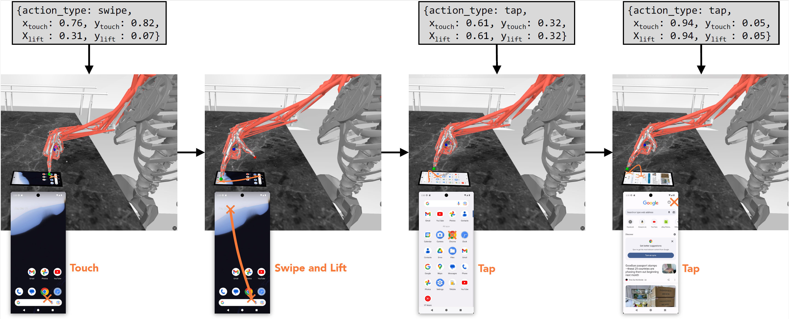

## Log2Motion: Biomechanical Motion Synthesis from Touch Logs
<div align="center">
  
</div>

## Prerequisites

Before starting, ensure that you have the following installed:
- **Conda** for managing Python environments
- **Android Studio** for setting up the Android environment
- 
## Directory Structure

- `environment/`
  Contains simulation environments, scene files, and MyoSuite rendering extensions.
  Includes two XML files—log2motion_scene.xml and log2motion_2scene.xml—which define the phone’s position and angle for their respective scenes.
- `policies/` — Pretrained policy files
- `videos/` — Example videos of the simulation
- `log2motion_visualization.py` — This is the main script for visualising the interaction with an Android device.
- `env.yml`, `mac_env.yml` — Environment setup files

## 1. Install Dependencies from Conda Environment File

First, create a Conda environment using the provided `environment.yml` file to install all necessary Python packages.

1. Download the repository or clone it using Git:

2. Create a Conda environment from the env.yml (Windows only for now)  file:

   ```bash
   conda env create -f environment.yml
   ```
    Or on MacOS: 
    ```bash
   conda env create -f mac_env.yml
   
3. Activate the environment:
    ```bash
    conda activate log2motion-env
## 2. Android Studio
1. After installing Android Studio, create an Android Virtual Device (AVD) following the instructions in this [official guide](https://github.com/google-deepmind/android_env/blob/main/docs/emulator_guide.md).
2. Set up the Android SDK as instructed in the guide, and ensure your device is running. 
3. After setting up the Android environment, you need to modify the `log2motion_visualization.py` file to provide the correct path to your Android device and environment.
 Find the following section in the file:

   ```python
   'avd_name': 'my_avd',
   'android_avd_home': 'C:/Users/USER_NAME/.android/avd',
   'android_sdk_root': 'C:/Users/USER_NAME/AppData/Local/Android/Sdk',
   'emulator_path': 'C:/Users/USER_NAME/AppData/Local/Android/Sdk/emulator/emulator',
   'adb_path': 'C:/Users/USER_NAME/AppData/Local/Android/Sdk/platform-tools/adb',
4. Replace the placeholder paths with the correct paths for your system:
   - avd_name: the name of the AVD specified when your created it in Android Studio.
   - android_avd_home : the path to where the AVD is installed. (default value: ~/.android/avd).
   - android_sdk_root : the root directory of the Android SDK. (default value: ~/Android/Sdk).
   - emulator_path : the path to the emulator binary. (default: ~/Android/Sdk/emulator/emulator).
## 3. Start and Run the Sample
```bash
    conda activate log2motion-env
    python log2motion_visualization.py
```
**NOTE:** On MacOS, mujoco native was moved to `launch_passive` which requires the Python script to be run under `mjpython`:
``` bash
mjpython log2motion_visualization.py
```

## License

See `LICENSE` for details.
